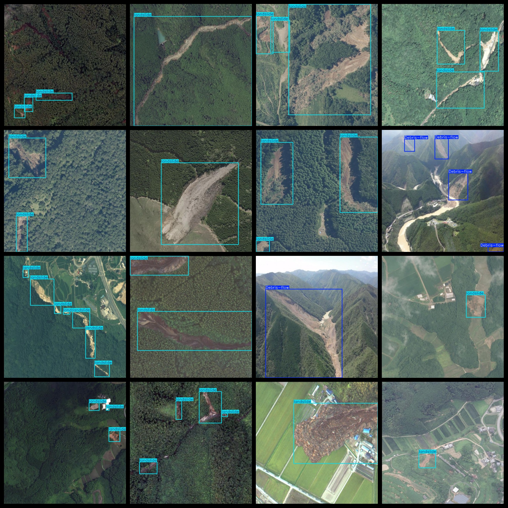
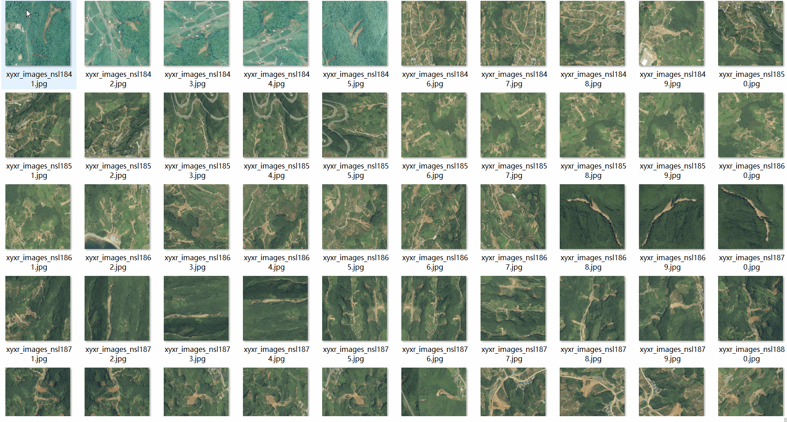

# Aerial Landslide Debris Flow Detection Dataset 2262 imagesVOC+YOLO format

The Geo-Eye Drone Observation Landslide and Mudslide Detection Data Set is 2262 VOC + YOLO format

Dataset format: Pascal VOC format + YOLO format (the txt file does not contain the split path, it only contains jpg images and corresponding VOC format xml files and yolo format txt files)

Number of images (number of jpg files): 2262

Number of xml files: 2,262

Number of txt files: 2262

Label count: 2

The Github repository is: datasets_sl

Annotation class names: ["Debris-flow","landslide"]

Number of boxes labeled in each category:

Debris-flow flux = 429

landslide frame count = 6079

Total Frames: 6508

Number of images per category:

Debris-flow occupying the image count = 106

Landslide occupying picture count = 2160

Image resolution: 640x640

Use the labeling tool: labelImg

Dataset Augmentation: Yes

Rules for annotation: Draw a rectangle around the category.

Important note: The dataset does not have been divided into training, validation, and testing sets.

Special Disclaimer: This dataset does not guarantee the accuracy of the trained models or weight files.

Annotation and image details are as follows:

## Images

---

Here is a pay link on Stripe (https://buy.stripe.com/3cs8yP7sY87d0vu9AB). Please contact me lonlonago@foxmail.com after funding $89, and I will send you a complete data files, thank you!

